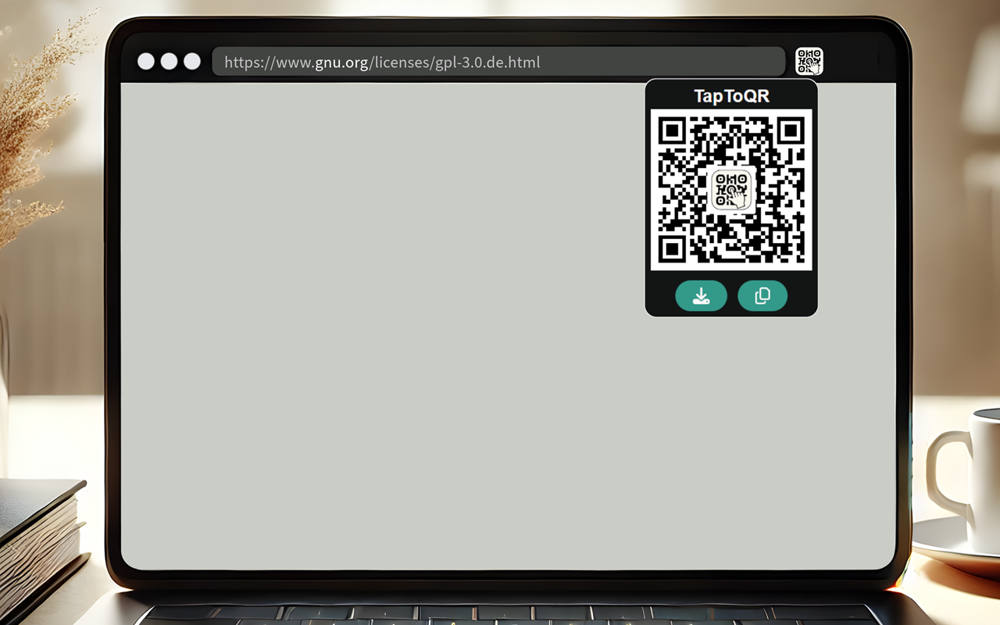
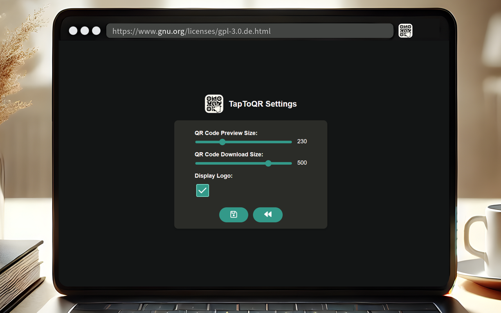

# TapToQR

***

  
  
  

## Description

With **TapToQR** you can instantly generate and share a QR code for the webpage you're currently viewing, making link sharing seamless and quick.

| Share current Page as QR code                                                                                                                                                                                        |
|----------------------------------------------------------------------------------------------------------------------------------------------------------------------------------------------------------------------|
| Click the **TapToQr** icon in the toolbar to generate a QR code for the current webpage. You can then scan the QR code with your phone, download it for later, or copy the image to your clipboard for easy sharing. |
|                                                                                                                                                                         |

| Settings                                                                                                            |
|---------------------------------------------------------------------------------------------------------------------|
| In the settings, you can customize the QR code size displayed in the popup and set the default download resolution. |
|                                                                        |

## Issues

All issues are tracked on the [GitHub repository](https://github.com/clFaster/TapToQR/issues). 
Feel free to report any bugs or suggest new features!
