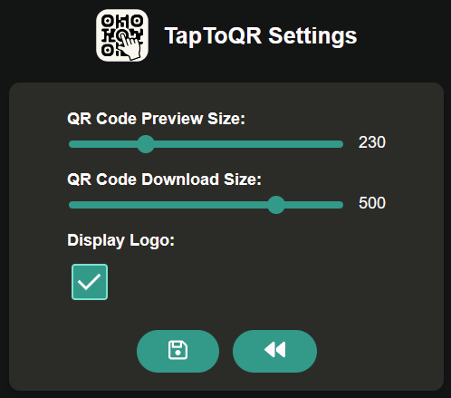

# TapToQR

## Description

With **TapToQR** you can instantly generate and share a QR code for the webpage you're currently viewing, making link sharing seamless and quick.

Click the **TapToQr** icon in the toolbar to generate a QR code for the current webpage.
You can then scan the QR code with your phone, download it for later,
or copy the image to your clipboard for easy sharing.

In the settings, you can customize the QR code size displayed in the popup and set the default download resolution.

## Issues

All issues are tracked on the [GitHub repository](https://github.com/clFaster/TapToQR/issues). 
Feel free to report any bugs or suggest new features!