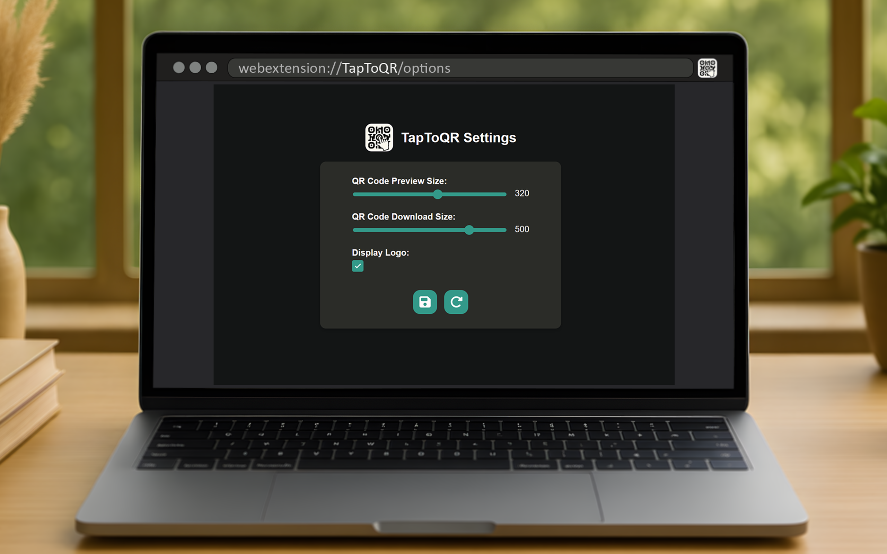
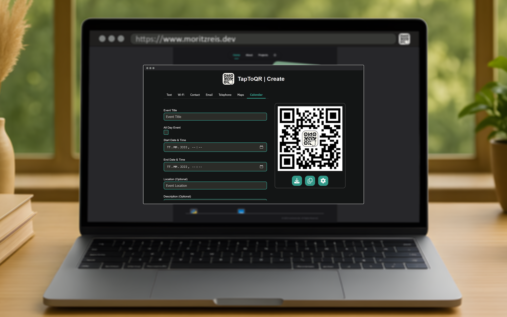

# TapToQR

Generate customizable QR codes from any webpage with **TapToQR** - instantly share links, text, or calendar events using a clean, intuitive browser extension with quick actions and personalization options.

***

  
  
  

## Description

### TapToQR – Share Instantly with QR Codes

**Generate exactly what you need-quickly and easily.**

**TapToQR** is a lightweight and intuitive browser extension that lets you generate custom QR codes right from your toolbar. Whether you want to share the current webpage, copy a link to your phone, or encode custom content like text, URLs, or calendar events, TapToQR makes it seamless.

### Key Features

- **One-Click QR Generation:** Click the toolbar icon to instantly generate a QR code for the active tab.
- **Custom Content Support:** Encode URLs, plain text, calendar events, and more.
- **Mobile-Friendly Sharing:** Open links on your phone instantly by scanning the code-no copy-paste needed.
- **Quick Actions:** Download, copy, or customize the QR code with built-in controls.
- **Personalization Options:** Set your preferred QR code preview size, download resolution, and toggle logo visibility.

### Simple Settings

Adjust the QR code preview and export size or configure your preferred visual style.

Whether you're a developer, a power user, or just looking to streamline cross-device browsing, **TapToQR** is your go-to QR tool-clean, fast, and effective.

## Screenshots

| TapToQR in Action |
|-------------------|
| Easily access the current page on your phone with a single scan. **TapToQR** instantly generates a QR code for the active browser tab, letting you open the same page on your mobile device in seconds-no copy-pasting required. Just scan and go. |
|  |

| Generate a QR Code Instantly|
|-----------------------------|
| Click the **TapToQR** icon in your browser toolbar to instantly generate a QR code for the current webpage. |
|  |

| Customize Your QR Code Experience |
|-----------------------------------|
| In the settings panel, you can adjust the preview size of the QR code shown in the popup and configure the default resolution for downloads. You can also toggle the embedded logo on or off to match your preferences. |
|  |

| Generate what you need |
|------------------------|
| With the **TapToQR** browser extension, you can generate custom QR codes containing various content types, such as calendar events, using a simple and intuitive interface. |
|  |

## License

This project is licensed under the GNU General Public License v3.0. See the [LICENSE](./LICENSE) file for details.

For more information, visit the [GNU GPL v3.0](https://www.gnu.org/licenses/gpl-3.0.html) page.

## Issues

All issues are tracked on the [GitHub repository](https://github.com/clFaster/TapToQR/issues). 
Feel free to report any bugs or suggest new features!
